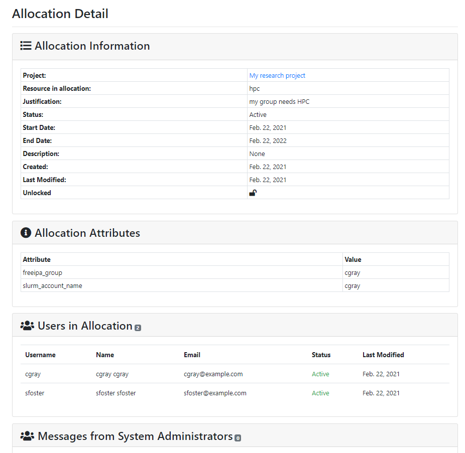
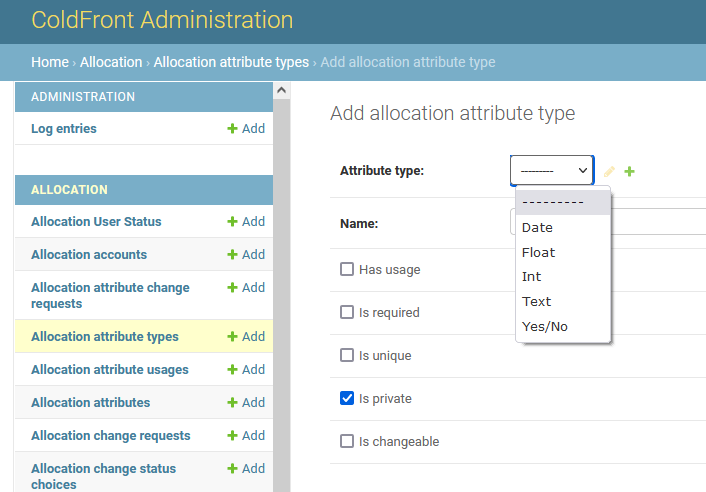

# What are Allocations?

Allocations in ColdFront are what provides the users access to a resource.  Allocations can contain attributes such as expiration dates that trigger email notifications.  Other attributes such has unix group, Slurm account, or storage quotas allow ColdFront plugins to interact with backend APIs and system processes.

- Allocations fall under projects in ColdFront.  
- A user must be a member of the project to be added to an allocation  
- All project members do not need to be on all project allocations  
- Allocations can have many attributes and there are standard allocation attributes configured in the base installation of ColdFront  
- Additional attributes can be added to ColdFront using the ColdFront Administration Dashboard  
- The types of attributes used on an allocation depend on what type of resource the allocation is for   
For example:  Cluster resource would have Slurm attributes, a Software License resource might have a UNIX group attribute, a Storage resource might have quota or directory attributes.  
- Attributes can be "public" which means they're visible to PIs and users on the allocation or they can be "private" and only viewable to administrators.  
- Allocations must have an expiration date.  
- Emails are triggered to all users on an allocation when the expiration date is 60 days away, 30 days, 7 days, and then expired, unless the user turns off notifications on the project.  
- PIs and Managers can not turn off email notifications for themselves but can for project users.  
- Once an allocation expires, access to that resource can be either removed or locked, depending on your Center's policy  
For example: When an allocation for a Slurm cluster expires, the Slurm plugin will remove the account and association, preventing users from running or submitting new jobs  

!!! Tip  
    Resources also have attributes that are inherited by the allocation.  This allows you to set an attribute once on the resource and not have to set it on every allocation for that resource.

## Allocation details
Access to ColdFront is role based so users see a read-only view of the allocation details for any allocations they are on.  PIs and managers see the same allocation details as users, but can also add project users to the allocation, if they're not already on it, and remove users from an allocation.  

### PI and Manager View
PIs and managers are able to view important details of the allocation including start and end dates, creation and last modified dates, users on the allocation and public allocation attributes.  PIs and managers are able to add or remove users from allocations.  

*NOTE:* the user must already be on the project in order to be added to the allocation.

### User View
Users who are not PIs or Managers on a project see a read-only view of the allocation details.  If a user is on a project but not a particular allocation, they will not be able to see the allocation in the Project view nor will they be able to access the Allocation detail page.

### Administrator View
Admins have the ability to update the status, start & end dates, and description on the Allocation Detail page.  They can also add or delete Allocation Attributes and Add or Remove Users.  All of this can also be done from the ColdFront Administration Dashboard.

*NOTE:* Users must exist on the Project before they can be added to the Allocation.  

### Center Staff    

System administrators will be able to see all allocations.  There are additional settings for center directors/administrators and those with 'staff status' enabled that you can add to allow them to view all allocations as well.  See the documentation on [director permissions](../users/director.md) and [staff permissions](../users/staff.md) for information on how to configure this.

System administrators can choose 'All Allocations' from the Admin menu.  Staff and center directors can choose 'All Allocations' from the 'Staff' menu.

The allocations search will allow you to filter on all possible allocation attributes, project information, username, type of resource or resource name, dates, and all allocation statuses. Enter the fields you want to search on and make sure to check 'Show all allocations' at the bottom before clicking the 'Search' button.  If you don't, you'll only see allocations that your user account is a member of.

In the resulting list, click on the allocation ID to bring you to the Allocation Detail page or click on the project name which will bring you to the Project Detail page.   

## Creating new allocation attribute types  

ColdFront has a default set of allocation attributes, some that tie into ColdFront plugins.  You can add new allocation attributes in the ColdFront Administration Dashboard under Allocations - Allocation Attribute Types  

  

   

Click the 'Add Allocation Attribute Type' to create a new one.  Enter a name and select the type of attribute from: Date, Float, Int, Text, Yes/No

All attributes on an allocation are displayed on the Allocation Detail page.  If you do not want the PI and allocation users to see a particular attribute, check the "Is private" checkbox.  System administrators will be able to view these attributes on the allocation detail page but they'll be marked with a lock icon.  Any others viewing the allocation will not see them at all.

### Allow allocation attribute changes  

In order for a PI/manager to request a change to an allocation attribute, such as storage quantity, the allocation attribute must be set to allow changes.  [See more here](change_requests.md)

