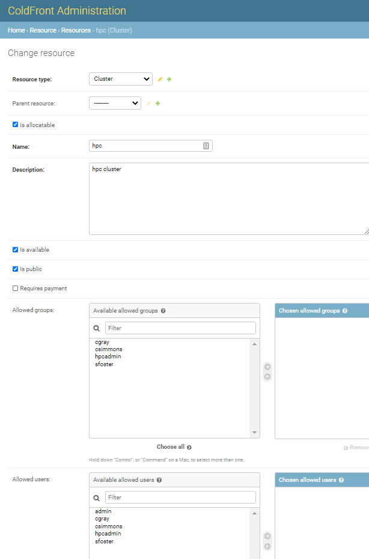
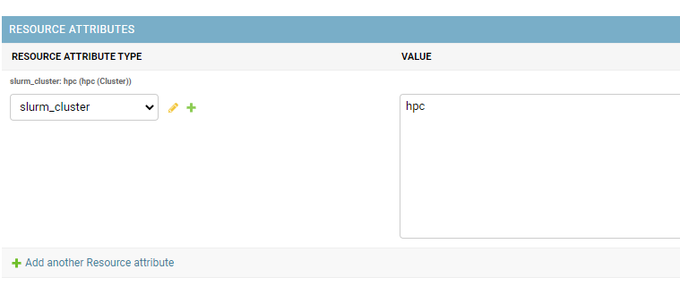
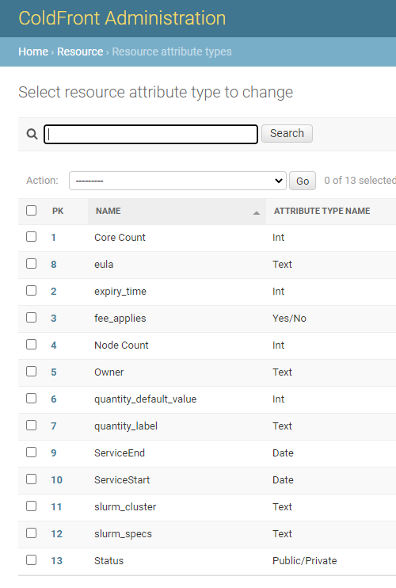

# Resources

The list of resources in ColdFront is everything that your center maintains and provides access to your user community.  These can be shared resources such as clusters and storage or they can be individual servers that only a single user or small group has access to.  A base install of ColdFront comes with the following types of resources:  Cluster, Cluster Partition, Server, Storage, Cloud, Software.  Additional resource types can be added and might include Database (for shared databases that a center restricts access to) or Instrument (for shared scientific instruments you need to manage access for).  Resources are managed in the ColdFront Administration Dashboard under Resources.

### Adding a new resource type

Click on the "Add Resource Type" button under Resource - Resource Type and enter a name and description for your new resource type.  You can also edit the names and descriptions of existing resource types or delete ones you don't want.

### Adding a new resource

Click on the "Add Resource" button under Resource - Resources and fill out the form.  This screenshot shows an example of a Cluster resource.
  

**Fields for the resource include:**  
**Resource Type:** select from the drop down menu  
**Parent Resource:** used for the Cluster Partition resource type as these partitions fall under a main cluster  
**Is Allocatable:** This should be checked for everything except a parent resource  
**Name:** Name your resource - this will show up in the drop-down menu when PIs request allocations, along with the resource type  
**Description:**  Description of your resource  
**Is Available:** Uncheck this if don't want users to see this resource in their list of resources to request an allocation for.  Useful for when you are setting up a new service and it's not ready for production yet or when you decommission a resource.  
**Is public:** Uncheck this if you don't want any users to see this resource.  
Requires payment:  Eventually this will be used with the Invoicing feature  
**Allowed groups:**  You can restrict the ability to request allocations for this resource by user group
**Allowed users:** You can restrict the ability to request allocations for this resource by user
**Resource attributes:**  These tie in the ColdFront plugins and are inherited by the allocations.  Anyone on an allocation for this resource will inherit these attributes.  Attributes can also be set on the allocation.

### Resource attributes

Resources have attributes that are inherited by allocations.  They are specific to the resource type.
  

- Cluster resources should have the 'slurm_cluster' attribute and the value should be your cluster's name found in the slurm config file.  They may also have the 'slurm specs' attribute if required by your slurm configuration
- Software license resources may contain the 'EULA' attribute and the value should be the text of the license, a URL to register for a license or instructions for complying with the license restrictions
- Server resources might have a 'Owner' attribute and/or Service Start and Service End Dates for warranty tracking purposes

### Creating new resource attribute types  

ColdFront has a set of resource attributes that tie into plugins.  You can add new resource attributes in the ColdFront Administration Dashboard under Resources - Resource Attribute Types  

  

Click the 'Add Attribute Type' to create a new one.  Enter a name and select the type of attribute from: Active/Inactive, Date, Int, Public/Private, Text, Yes/No

### Creating new attribute types
To add a new attribute type, click the green plus sign next to "attribute type" or go to Resource - Attribute types to add a new option.

  
